# CLAUDE.md

This file provides guidance to Claude Code (claude.ai/code) when working with code in this repository.

**Default repository**: [RushAI-jcr/policychat_rush](https://github.com/RushAI-jcr/policychat_rush). `origin` is configured as the default push target; use `git push` to update it.

## Project Overview

RUSH Policy RAG Agent - A production-ready RAG (Retrieval-Augmented Generation) system for policy retrieval at Rush University System for Health.

**Tech Stack**: FastAPI backend + Next.js 16 frontend + Azure OpenAI "On Your Data" (vectorSemanticHybrid) + Docling/PyMuPDF PDF processing

**Architecture Status**: ✅ COMPLETED - Single backend (FastAPI + Next.js only, no Azure Functions)

## Azure Services Required

This application **requires** the following Azure services to function:

| Azure Service | Purpose | Required |
|---------------|---------|----------|
| **Azure AI Search** | Vector store (3072-dim embeddings) + semantic ranking + 132 synonym rules | ✅ **Required** |
| **Azure OpenAI** | GPT-4.1 (chat) + text-embedding-3-large (embeddings) | ✅ **Required** |
| **Azure AI Foundry (Cohere)** | Cohere Rerank 4.0 Pro cross-encoder deployment | ✅ **Required** |
| **Azure Blob Storage** | PDF document storage (3 containers: source, active, archive) | ✅ **Required** |
| **Azure Container Apps** | Host FastAPI backend + Next.js frontend | ✅ **Required** |
| **Azure Communication Services** | Weekly evaluation email reports | Optional |
| **Azure AD** | Authentication for production | Optional |

See [DEPLOYMENT.md](docs/DEPLOYMENT.md) for step-by-step Azure resource creation commands.

## Azure Infrastructure (Deployed)

**IMPORTANT**: All resources are deployed in the following location:

| Setting | Value |
|---------|-------|
| **Subscription** | `RU-Azure-NonProd` (ID: `e5282183-61c9-4c17-a58a-9442db9594d5`) |
| **Resource Group** | `RU-A-NonProd-AI-Innovation-RG` |
| **Location** | `eastus` |

**Deployed Resources:**

| Resource | Name | Type |
|----------|------|------|
| Container Apps Environment | `rush-policy-env-production` | Microsoft.App/managedEnvironments |
| Backend Container App | `rush-policy-backend` | Microsoft.App/containerApps |
| Frontend Container App | `rush-policy-frontend` | Microsoft.App/containerApps |
| Container Registry | `aiinnovation` | Microsoft.ContainerRegistry/registries |
| AI Search | `policychataisearch` | Microsoft.Search/searchServices |
| Blob Storage | `policytechrush` | Microsoft.Storage/storageAccounts |
| Cognitive Services | `rua-nonprod-ai-innovation` | Microsoft.CognitiveServices/accounts |
| Communication Services | `rush-policy-comm` | Microsoft.Communication/communicationServices |
| Email Services | `rush-policy-email` | Microsoft.Communication/emailServices |

**Live URLs:**
- Backend: `https://rush-policy-backend.salmonmushroom-220eb8b3.eastus.azurecontainerapps.io`
- Frontend: `https://rush-policy-frontend.salmonmushroom-220eb8b3.eastus.azurecontainerapps.io`

### Azure AD Easy Auth Configuration

Both Container Apps have Azure AD Easy Auth enabled at the **ingress layer** (before traffic reaches the app):

| Container App | Unauthenticated Action | Excluded Paths |
|---------------|----------------------|----------------|
| **Frontend** | `RedirectToLoginPage` | `/api/chat`, `/api/chat/stream`, `/api/health`, `/api/search-instances`, `/api/sync-info`, `/api/pdf` |
| **Backend** | `AllowAnonymous` | None (all traffic allowed) |

The frontend API routes (`/api/*`) are excluded from auth so the Next.js proxy can forward requests to the backend without AAD tokens. UI pages still require AAD login.

**Known issue**: The `az containerapp auth update --excluded-paths` CLI command has a [bug that trims path characters](https://github.com/microsoft/azure-container-apps/issues/464). Use the REST API instead:
```bash
az rest --method PUT \
  --url "/subscriptions/e5282183-61c9-4c17-a58a-9442db9594d5/resourceGroups/RU-A-NonProd-AI-Innovation-RG/providers/Microsoft.App/containerApps/rush-policy-frontend/authConfigs/current?api-version=2024-03-01" \
  --body '{ "properties": { "platform": { "enabled": true }, "globalValidation": { "unauthenticatedClientAction": "RedirectToLoginPage", "redirectToProvider": "azureactivedirectory", "excludedPaths": ["/api/chat", "/api/chat/stream", "/api/health", "/api/search-instances", "/api/sync-info", "/api/pdf"] }, "identityProviders": { "azureActiveDirectory": { "isAutoProvisioned": true, "registration": { "clientId": "ea94d628-0f36-40f5-98b2-48fcf9167aa0", "clientSecretSettingName": "microsoft-provider-authentication-secret", "openIdIssuer": "https://sts.windows.net/822ee4ca-eeac-4bf4-957b-97a4bb0b1697/v2.0" }, "validation": { "allowedAudiences": ["api://ea94d628-0f36-40f5-98b2-48fcf9167aa0"] } } } } }'
```

**If new frontend API routes are added**, they must be appended to the `excludedPaths` array or they will be blocked by Easy Auth with a 401.

**Before deploying**, ensure you're logged into the correct subscription:
```bash
az account set --subscription "RU-Azure-NonProd"
az account show  # Verify: should show "RU-Azure-NonProd"
```

## Container Deployment (ACR → Azure Container Apps)

**Automated**: Deployment is handled by GitHub Actions. Pushing to `main` triggers CI (`ci.yml`), and on success, `deploy.yml` builds SHA-tagged images and deploys to NonProd automatically. See [docs/CICD_PIPELINE.md](docs/CICD_PIPELINE.md) for the full pipeline architecture.

**Manual fallback**: Use the commands below for emergency deployments or local debugging. Always use `az acr build` for remote builds — no local Docker required.

### Deploy Backend
```bash
TAG=$(git rev-parse --short HEAD)
az acr build --registry aiinnovation --platform linux/amd64 --image rush-policy-backend:$TAG --file apps/backend/Dockerfile apps/backend
az containerapp update -n rush-policy-backend -g RU-A-NonProd-AI-Innovation-RG --image aiinnovation.azurecr.io/rush-policy-backend:$TAG
```

### Deploy Frontend
```bash
TAG=$(git rev-parse --short HEAD)
az acr build --registry aiinnovation --platform linux/amd64 --image rush-policy-frontend:$TAG --file apps/frontend/Dockerfile apps/frontend
az containerapp update -n rush-policy-frontend -g RU-A-NonProd-AI-Innovation-RG --image aiinnovation.azurecr.io/rush-policy-frontend:$TAG
```

### Deploy Both (Full Deployment)
```bash
TAG=$(git rev-parse --short HEAD)

# Backend
az acr build --registry aiinnovation --platform linux/amd64 --image rush-policy-backend:$TAG --file apps/backend/Dockerfile apps/backend
az containerapp update -n rush-policy-backend -g RU-A-NonProd-AI-Innovation-RG --image aiinnovation.azurecr.io/rush-policy-backend:$TAG

# Frontend
az acr build --registry aiinnovation --platform linux/amd64 --image rush-policy-frontend:$TAG --file apps/frontend/Dockerfile apps/frontend
az containerapp update -n rush-policy-frontend -g RU-A-NonProd-AI-Innovation-RG --image aiinnovation.azurecr.io/rush-policy-frontend:$TAG
```

## Architecture

```mermaid
flowchart TB
    subgraph ingestion [Document Ingestion]
        PDF[PDF Upload] --> Source[policies-source]
        Source --> Chunker[PolicyChunker]
        Chunker --> Index[Azure AI Search]
        Index --> Active[policies-active]
    end

    subgraph query [Query Pipeline]
        User[User] --> Frontend[Next.js :3000]
        Frontend --> Backend[FastAPI :8000]
        Backend --> Synonyms[SynonymService]
        Synonyms --> AOAI[Azure OpenAI + vectorSemanticHybrid]
        AOAI --> Cohere[Cohere Rerank 4.0 Pro]
        Cohere --> Expander[Context Expander]
        Expander --> Response[Response + Citations]
    end
```



**Ingestion**: PDF → PolicyChunker (PyMuPDF + Docling) → 3072-dim embeddings → Azure AI Search (38-field schema, 9 entity filters)

**Query**: User → Next.js → FastAPI → Synonym expansion → vectorSemanticHybrid (GPT-4.1) → Cohere Rerank (top 5, min 0.40) → Context expansion (±1 siblings) → Cited response

## Commands

### Quick Start
```bash
./start_backend.sh   # Creates venv, installs deps, runs backend (:8000)
./start_frontend.sh  # Installs deps if needed, runs frontend (:3000)
```

### Development
```bash
# Frontend (from /apps/frontend/)
npm run dev          # Dev server with hot reload
npm run build        # Production build
npm run check        # TypeScript check

# Backend (from /apps/backend/)
python main.py       # Run dev server
pip install -r requirements.txt
```

### Document Ingestion (from /apps/backend/)
```bash
python scripts/full_pipeline_ingest.py --run-tests  # RECOMMENDED: Full pipeline + validation
python policy_sync.py sync                          # Incremental sync only
python scripts/upload_pdfs_to_blob.py               # Upload PDFs for viewing feature
```

### Testing
```bash
# Quick validation
pytest apps/backend/tests/test_rag_evaluation.py -v -m "critical"

# Full test suite
python scripts/run_test_dataset.py
python scripts/run_enhanced_evaluation.py

# Post-index RAG accuracy
python tests/rag_accuracy/run_post_index_test.py --quick
```

### Weekly Monitoring
```bash
python scripts/weekly_eval.py --dry-run             # Technical evaluation
python scripts/generate_executive_report.py --dry-run  # Executive report
```

**Test Dataset**: Generated via `scripts/generate_test_dataset_v5.py` (output is gitignored in `apps/backend/data/`)
**Thresholds**: Pass rate >= 80%, Faithfulness >= 0.85, Context Recall >= 0.80

See [docs/RAG_TESTING_PLAN.md](docs/RAG_TESTING_PLAN.md) for comprehensive testing documentation.

## Project Structure

```
rag_pt_rush/
├── apps/
│   ├── backend/                    # FastAPI backend (:8000)
│   │   ├── main.py                 # API entrypoint
│   │   ├── app/
│   │   │   ├── api/routes/         # chat.py, search.py, pdf.py, admin.py
│   │   │   ├── core/               # config, auth, security, rate_limit,
│   │   │   │                       #   circuit_breaker, index_safety,
│   │   │   │                       #   logging_middleware, prompts
│   │   │   ├── services/           # 24 services (see catalog below)
│   │   │   ├── models/             # schemas.py, audit_schemas.py
│   │   │   └── evaluation/         # DeepEval metrics, diagnostics
│   │   ├── preprocessing/          # PolicyChunker (Docling + PyMuPDF)
│   │   │   ├── chunker.py          # Main chunking pipeline
│   │   │   ├── checkbox_extractor.py # "Applies To" checkbox parsing
│   │   │   ├── metadata_extractor.py # Policy metadata extraction
│   │   │   ├── policy_chunk.py     # PolicyChunk data model
│   │   │   └── rush_metadata.py    # RUSH-specific metadata rules
│   │   ├── scripts/                # Backend-specific scripts
│   │   └── policytech_prompt.txt   # RISEN prompt framework
│   │
│   └── frontend/                   # Next.js 16 (:3000)
│       └── src/
│           ├── app/                # App Router pages
│           │   └── api/            # Route handlers (chat, health, pdf, search-instances, sync-info)
│           ├── components/         # ChatInterface, ChatMessage, PDFViewer, etc.
│           │   ├── chat/           # Chat-specific components
│           │   └── ui/             # Shared UI primitives (Radix-based)
│           ├── hooks/              # useSyncInfo, useMobile, useToast
│           ├── lib/                # api.ts, utils.ts, sanitize.ts, chatMessageFormatting.ts, constants.ts
│           └── __tests__/          # security.test.ts
│
├── scripts/                        # Ingestion, evaluation, deployment
├── tests/rag_accuracy/             # Post-indexing validation
└── docs/                           # Architecture, security, testing, ops
```

### Key Backend Services (`apps/backend/app/services/`)

**Core Services**

| Service | Purpose |
|---------|---------|
| `chat_service.py` | Main RAG orchestrator |
| `on_your_data_service.py` | Azure OpenAI "On Your Data" vectorSemanticHybrid |
| `cohere_rerank_service.py` | Cohere Rerank 4.0 Pro cross-encoder |

**Retrieval Enhancement**

| Service | Purpose |
|---------|---------|
| `synonym_service.py` | Query-time synonym expansion (132 rules) |
| `context_expander.py` | Sibling chunk retrieval (±1 chunks) |
| `corrective_rag.py` | Corrective RAG (cRAG) document filtering |
| `self_reflective_rag.py` | Self-reflective RAG quality checks |
| `instance_search_service.py` | Within-policy section search |

**Query Processing**

| Service | Purpose |
|---------|---------|
| `query_processor.py` | Query preprocessing pipeline |
| `query_validation.py` | Input validation, adversarial detection, prompt injection defense |
| `query_enhancer.py` | Query rewriting and clarification |
| `query_decomposer.py` | Multi-part query decomposition |
| `device_disambiguator.py` | Medical device ambiguity detection |
| `entity_ranking.py` | Entity-aware result ranking |
| `ranking_utils.py` | Score normalization and ranking helpers |

**Response Processing**

| Service | Purpose |
|---------|---------|
| `response_formatter.py` | Response formatting and structuring |
| `citation_formatter.py` | Citation formatting for evidence cards |
| `citation_verifier.py` | Citation accuracy verification |
| `safety_validator.py` | Safety and compliance validation |
| `confidence_calculator.py` | Response confidence scoring |

**Infrastructure**

| Service | Purpose |
|---------|---------|
| `cache_service.py` | Multi-layer LRU/TTL caching (~50MB budget) |
| `chat_audit_service.py` | Non-blocking audit logging to Azure Blob |
| `search_result.py` | Search result data model |
| `search_synonyms.py` | Index-time synonym map management |

## Key Technical Details

### PDF Processing
- **PyMuPDF**: Primary for checkbox extraction ("Applies To" patterns)
- **Docling**: TableFormer ACCURATE mode, hierarchical chunking (~1,500 chars)
- **Fallback chain**: PyMuPDF → Docling → Regex

### Azure AI Search Schema
- 38 fields: `content`, `content_vector` (3072-dim), `title`, `reference_number`, etc.
- 9 entity boolean filters: `applies_to_rumc`, `applies_to_rumg`, `applies_to_rmg`, etc.
- Hierarchical chunking: `chunk_level`, `parent_chunk_id`, `chunk_index`

### RAG Pipeline Configuration
- **Model**: GPT-4.1 via Azure OpenAI "On Your Data"
- **Search**: vectorSemanticHybrid (Vector + BM25 + L2 Reranking)
- **Cohere Rerank 4.0 Pro**: Top 5 docs, min score 0.40
- **Context Expansion**: Top 3 reranked → ±1 sibling chunks
- **Test Pass Rate**: 88%

### Synonym System
Two-layer strategy: query-time expansion (`synonym_service.py`) + index-time synonyms (`azure_policy_index.py`). 132 rules across 15 healthcare categories. Source: `semantic-search-synonyms.json`

### RISEN Prompt Framework (`policytech_prompt.txt`)
**R**ole (strict RAG) → **I**nstructions (knowledge base only) → **S**teps (search/extract/cite) → **E**nd goal (Quick Answer + Policy Reference) → **N**arrowing (no hallucinations)

### RUSH Brand Colors
`#006332` (Legacy Green), `#30AE6E` (Growth Green), `#5FEEA2` (Vitality Green), `#DFF9EB` (Sage Green)

## Required Environment Variables

```bash
# Azure AI Search
SEARCH_ENDPOINT=https://policychataisearch.search.windows.net
SEARCH_API_KEY=<key>

# Azure OpenAI
AOAI_ENDPOINT=https://<your-aoai>.openai.azure.com/
AOAI_API_KEY=<api-key>
AOAI_CHAT_DEPLOYMENT=gpt-4.1
AOAI_EMBEDDING_DEPLOYMENT=text-embedding-3-large

# Azure Storage
STORAGE_CONNECTION_STRING=<connection_string>
SOURCE_CONTAINER_NAME=policies-source
CONTAINER_NAME=policies-active

# Cohere Rerank
USE_COHERE_RERANK=true
COHERE_RERANK_ENDPOINT=https://<cohere>.models.ai.azure.com
COHERE_RERANK_API_KEY=<api-key>

# Security (set true in production)
REQUIRE_AAD_AUTH=false
BACKEND_URL=http://localhost:8000
```

### RAG Pipeline Tuning (optional overrides in `.env`)

```bash
# Corrective RAG document filtering
CRAG_MIN_DOCS_FOR_COHERE=20    # Min docs passed to Cohere (default: 20)
CRAG_MAX_DOCS_FOR_COHERE=35    # Max docs passed to Cohere (default: 35)
CRAG_MAX_AMBIGUOUS_DOCS=20     # Max ambiguous docs per case (default: 20)

# Entity/location ranking
SURGE_CAPACITY_PENALTY=0.6     # Score penalty for surge-capacity policies (default: 0.6)
LOCATION_MATCH_BOOST=1.3       # Boost for entity-matched policies (default: 1.3)
PEDIATRIC_BOOST=1.3            # Boost for peds policies in peds context (default: 1.3)
ADULT_DEFAULT_BOOST=1.2        # Boost for adult/general policies (default: 1.2)
```

See `.env.example` for complete list and [docs/ENV_VARS.md](docs/ENV_VARS.md) for all variables.

## Azure Blob Storage

```
policies-source/   ← Upload new/updated PDFs here (staging)
policies-active/   ← Production (auto-synced)
policies-archive/  ← Deleted policies (auto-archived)
```

**Sync**: `python policy_sync.py sync` — uses SHA-256 hashing to detect changes.

## Policy Updates

See [docs/MONTHLY_UPDATE_PROCEDURES.md](docs/MONTHLY_UPDATE_PROCEDURES.md) for versioning, status lifecycle (DRAFT → ACTIVE → SUPERSEDED → RETIRED), and detailed procedures.

## API Documentation

Backend running: http://localhost:8000/docs (Swagger)
