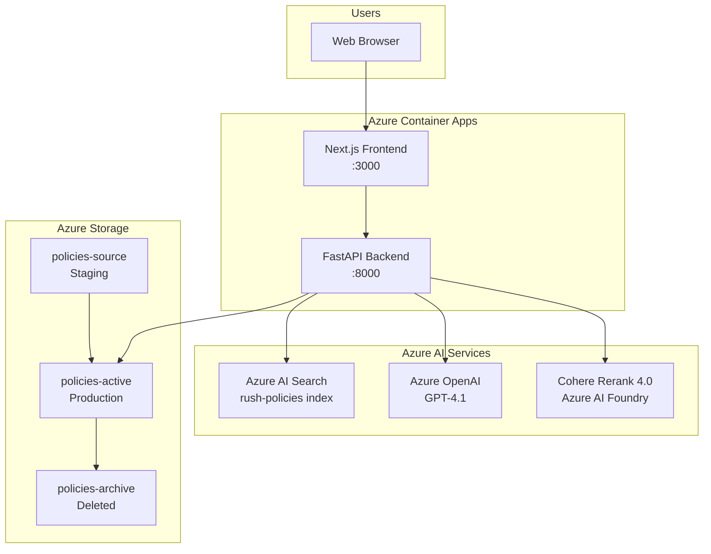
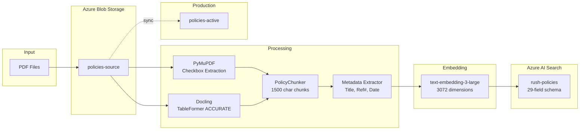
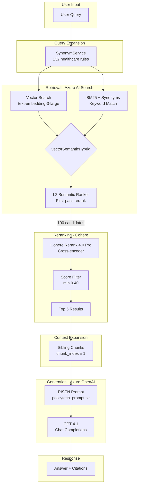
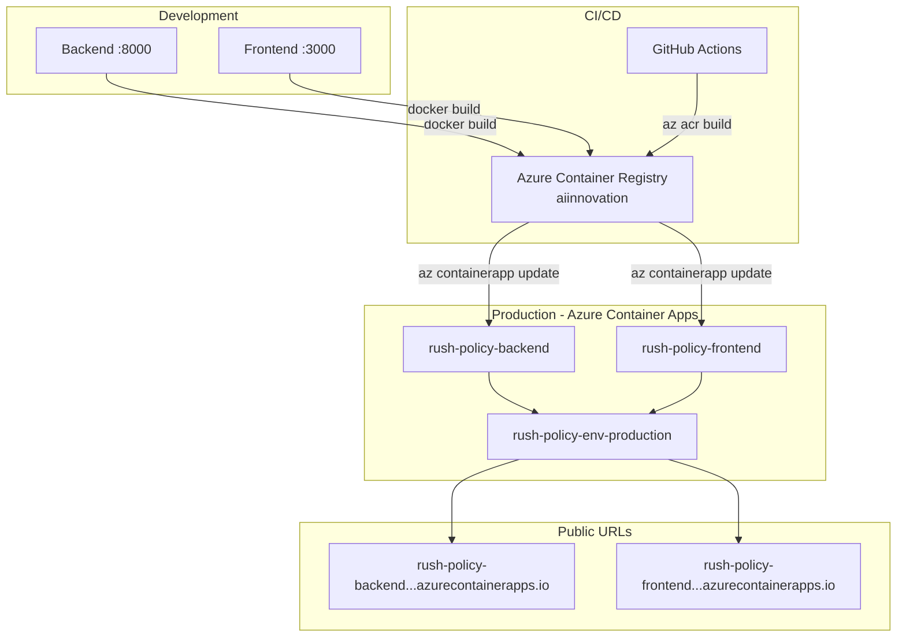
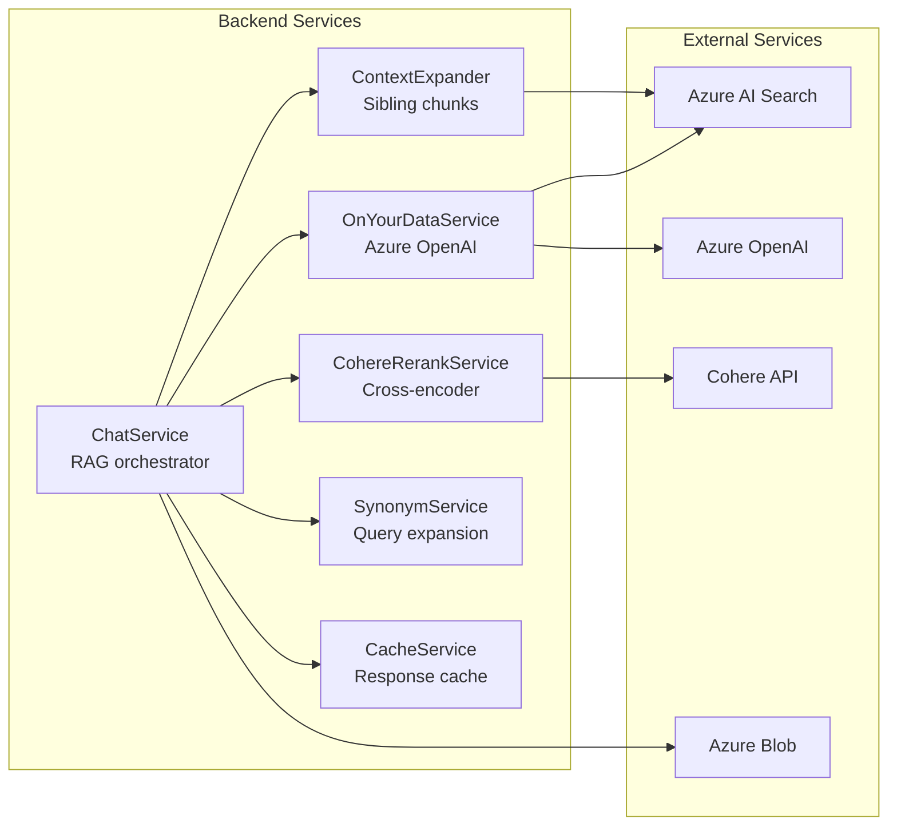

# Architecture Diagrams

Visual diagrams of the RUSH Policy RAG Agent architecture.

## 1. High-Level System Architecture

## 2. Document Ingestion Pipeline

### Ingestion Steps

1. **Upload**: PDFs uploaded to `policies-source` blob container
2. **Extract**: PyMuPDF extracts checkboxes, Docling extracts content
3. **Chunk**: PolicyChunker creates ~1500 char hierarchical chunks
4. **Metadata**: Extract title, reference number, applies-to entities
5. **Embed**: Generate 3072-dim vectors with text-embedding-3-large
6. **Index**: Upload to Azure AI Search with 29-field schema
7. **Sync**: Copy processed PDFs to `policies-active` for viewing

## 3. Query Pipeline (RAG)

### Query Steps

1. **Expand**: Add synonyms (ED → emergency department)
2. **Search**: Azure AI Search with vectorSemanticHybrid (100 candidates)
3. **Rerank**: Cohere cross-encoder reorders by relevance
4. **Filter**: Remove low-score documents (< 0.40)
5. **Expand Context**: Fetch sibling chunks for procedural completeness
6. **Generate**: GPT-4.1 with RISEN prompt framework
7. **Respond**: Answer with policy citations

## 4. Deployment Architecture

### Deployment Steps

1. **Build**: `docker build --platform linux/amd64`
2. **Push**: `docker push aiinnovation.azurecr.io/...`
3. **Update**: `az containerapp update --image ...`

**Critical**: Always use `--platform linux/amd64` for Azure.

## 5. Service Dependencies

## 6. Data Flow Summary

| Stage | Input | Process | Output |
|-------|-------|---------|--------|
| **Ingestion** | PDF files | Docling + PyMuPDF → Chunking → Embedding | Search index |
| **Query** | User question | Synonym expansion | Expanded query |
| **Retrieval** | Expanded query | vectorSemanticHybrid | 100 candidates |
| **Reranking** | 100 candidates | Cohere cross-encoder | Top 5 docs |
| **Expansion** | Top 5 docs | Sibling chunk fetch | Complete context |
| **Generation** | Context + prompt | GPT-4.1 | Answer + citations |

## Related Documentation

- [RAG_DESIGN.md](RAG_DESIGN.md) - Detailed design decisions
- [QUICK_START.md](QUICK_START.md) - Get started in 30 minutes
- [DEPLOYMENT.md](../DEPLOYMENT.md) - Full deployment guide
- [TECHNICAL_ARCHITECTURE_PWC.md](TECHNICAL_ARCHITECTURE_PWC.md) - Technical review document
