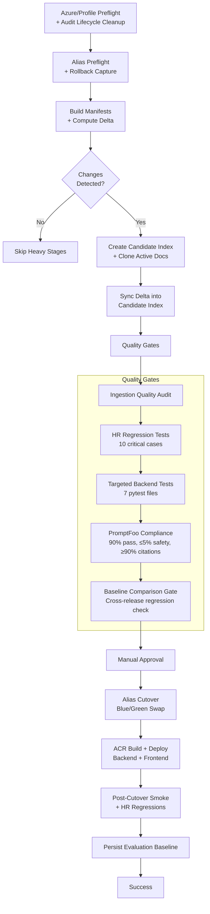
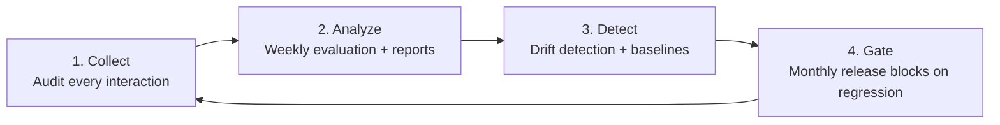

# Audit Logging & RAG Quality Assessment

> How the RUSH Policy RAG system captures, evaluates, and improves retrieval quality over time.

> **Executive Summary**: Every user query and RAG response is captured via non-blocking audit logging to Azure Blob Storage, ensuring full observability without impacting response times. Automated weekly evaluations check faithfulness, citation accuracy, and safety across sampled production queries. Monthly drift detection compares operational metrics month-over-month to flag regressions in retrieval quality before they affect users. The monthly release pipeline enforces 5 quality gates — including PromptFoo compliance, HR regression tests, and cross-release baseline comparison — and blocks deployment if any metric degrades beyond its threshold.

## Table of Contents

1. [Audit Logging Architecture](#1-audit-logging-architecture)
2. [Audit Record Schema](#2-audit-record-schema)
3. [Admin API Reference](#3-admin-api-reference)
4. [Monthly QA Pipeline Overview](#4-monthly-qa-pipeline-overview)
5. [Evaluation Frameworks](#5-evaluation-frameworks)
6. [Drift Detection Strategy](#6-drift-detection-strategy)
7. [Evaluation Baseline Persistence](#7-evaluation-baseline-persistence)
8. [Feedback Loop: How Logs Improve the System](#8-feedback-loop-how-logs-improve-the-system)
9. [Data Lifecycle & HIPAA](#9-data-lifecycle--hipaa)

---

## 1. Audit Logging Architecture

Every chat interaction is captured as a structured JSONL record in Azure Blob Storage. The audit system is designed to be **non-blocking** — audit failures never affect user-facing responses.

### Non-Blocking Buffered Pattern

```
User → /chat endpoint → ChatService → Response returned immediately
                              ↓
                     asyncio.create_task()      ← fire-and-forget (chat.py:127)
                              ↓
                     ChatAuditService.log_chat()
                              ↓
                     In-memory buffer (deque)
                              ↓
                     Background flush loop (every 30s or 50 records)
                              ↓
                     Azure Blob Storage: chat-audit/YYYY/MM/DD.jsonl
```

The fire-and-forget pattern in `apps/backend/app/api/routes/chat.py:124-136` ensures the audit call never blocks the response:

```python
audit_task = asyncio.create_task(
    get_chat_audit_service().log_chat(
        request=body, response=response, latency_ms=latency_ms,
        pipeline_used=pipeline, search_query=response.search_query,
    )
)
audit_task.add_done_callback(_handle_audit_task_exception)
```

### Azure Blob Storage Layout

```
chat-audit/                    (blob container)
├── 2026/
│   ├── 01/
│   │   ├── 01.jsonl           (all queries from Jan 1)
│   │   ├── 02.jsonl
│   │   └── ...
│   ├── 02/
│   │   ├── 01.jsonl
│   │   └── ...
│   └── ...
```

Each `.jsonl` file contains one JSON record per line, appended via download-merge-upload (BlockBlob does not support append).

### Service Lifecycle

| Event | Location | What Happens |
|-------|----------|-------------|
| **Startup** | `dependencies.py:323` | `await init_chat_audit_service()` — creates container if missing, starts background flush loop |
| **Each request** | `chat.py:127` | `asyncio.create_task(log_chat(...))` — adds record to in-memory buffer |
| **Buffer full** | `chat_audit_service.py:162` | Immediate flush when buffer reaches `CHAT_AUDIT_BUFFER_SIZE` |
| **Timer tick** | `chat_audit_service.py:221` | Background task flushes every `CHAT_AUDIT_FLUSH_INTERVAL_SECONDS` |
| **Shutdown** | `dependencies.py:387` | `await shutdown_chat_audit_service()` — cancels background task, flushes remaining records |

### Configuration

All settings are in `apps/backend/app/core/config.py:109-116`:

| Setting | Default | Description |
|---------|---------|-------------|
| `CHAT_AUDIT_ENABLED` | `true` | Master enable/disable |
| `CHAT_AUDIT_CONTAINER` | `chat-audit` | Azure Blob container name |
| `CHAT_AUDIT_BUFFER_SIZE` | `50` | Records to buffer before flushing |
| `CHAT_AUDIT_FLUSH_INTERVAL_SECONDS` | `30` | Max seconds between flushes |
| `CHAT_AUDIT_MAX_QUESTION_LENGTH` | `2000` | Truncate questions beyond this length |
| `CHAT_AUDIT_MAX_RESPONSE_LENGTH` | `5000` | Truncate responses beyond this length |
| `CHAT_AUDIT_RETENTION_DAYS` | `90` | Days to retain audit logs (enforced by lifecycle cleanup) |

---

## 2. Audit Record Schema

Defined in `apps/backend/app/models/audit_schemas.py:22-57` (`ChatAuditRecord`):

| Field | Type | Description |
|-------|------|-------------|
| `audit_id` | `str` (UUID) | Unique identifier for this record |
| `timestamp` | `datetime` | UTC timestamp of the chat request |
| `question` | `str` | User's question (truncated to 2,000 chars) |
| `filter_applies_to` | `str?` | Entity filter if applied (e.g., `rumc`, `rumg`) |
| `response` | `str` | LLM response text (truncated to 5,000 chars) |
| `summary` | `str` | Quick answer summary |
| `found` | `bool` | Whether a matching policy was found |
| `citations` | `AuditCitation[]` | Up to 10 citation objects |
| `chunks_used` | `int` | Number of chunks used in context |
| `confidence` | `"high" \| "medium" \| "low"` | Response confidence level |
| `confidence_score` | `float?` | Numeric confidence (0.0–1.0) |
| `needs_human_review` | `bool` | Flagged for human review |
| `safety_flags` | `str[]` | Safety/quality flag labels |
| `latency_ms` | `int` | End-to-end response time in milliseconds |
| `pipeline_used` | `str` | Pipeline identifier (e.g., `cohere_rerank`) |
| `search_query` | `str?` | Expanded query after synonym expansion |

Each `AuditCitation` contains:

| Field | Type |
|-------|------|
| `title` | `str` |
| `reference_number` | `str` |
| `section` | `str?` |
| `source_file` | `str?` |
| `reranker_score` | `float?` |

### Example JSONL Record

```json
{
  "audit_id": "f47ac10b-58cc-4372-a567-0e02b2c3d479",
  "timestamp": "2026-02-12T15:30:00+00:00",
  "question": "What is the code blue policy at RUMC?",
  "filter_applies_to": "rumc",
  "response": "According to RUSH Policy RU-C 01.00 (Code Blue Protocol)...",
  "summary": "Code Blue is activated for cardiac arrest situations.",
  "found": true,
  "citations": [
    {
      "title": "Code Blue Protocol",
      "reference_number": "RU-C 01.00",
      "section": "Emergency Response",
      "source_file": "Code_Blue_Protocol_(RU-C_01.00).pdf",
      "reranker_score": 0.87
    }
  ],
  "chunks_used": 5,
  "confidence": "high",
  "confidence_score": 0.92,
  "needs_human_review": false,
  "safety_flags": [],
  "latency_ms": 2340,
  "pipeline_used": "cohere_rerank",
  "search_query": "code blue emergency cardiac arrest protocol RUMC Rush University Medical Center"
}
```

---

## 3. Admin API Reference

All audit endpoints require the `X-Admin-Key` header. Defined in `apps/backend/app/api/routes/admin.py`.

### `GET /admin/audit/dates`

List dates with available audit logs (most recent first).

```bash
curl -H "X-Admin-Key: $ADMIN_API_KEY" \
  "http://localhost:8000/admin/audit/dates?limit=30"
```

**Response:**
```json
{
  "dates": ["2026-02-12", "2026-02-11", "2026-02-10"],
  "count": 3
}
```

### `GET /admin/audit/records/{date}`

Get audit records for a specific date with optional filters.

```bash
curl -H "X-Admin-Key: $ADMIN_API_KEY" \
  "http://localhost:8000/admin/audit/records/2026-02-12?limit=50&found=false"
```

**Query parameters:** `limit` (1–1000), `offset`, `found` (bool), `confidence` (high/medium/low), `needs_human_review` (bool)

**Response:** `AuditQueryResponse` with `records`, `total_count`, `query_date`

### `GET /admin/audit/stats/{date}`

Get aggregated statistics for a specific date.

```bash
curl -H "X-Admin-Key: $ADMIN_API_KEY" \
  "http://localhost:8000/admin/audit/stats/2026-02-12"
```

**Response:**
```json
{
  "date": "2026-02-12",
  "total_queries": 145,
  "found_count": 132,
  "not_found_count": 13,
  "confidence_breakdown": {"high": 98, "medium": 35, "low": 12},
  "needs_review_count": 3,
  "safety_flags_count": 1,
  "unique_safety_flags": ["LOW_GROUNDING"],
  "avg_latency_ms": 2150.5,
  "p95_latency_ms": 3420,
  "pipeline_breakdown": {"cohere_rerank": 145}
}
```

### `GET /admin/audit/today`

Convenience endpoint for today's records.

```bash
curl -H "X-Admin-Key: $ADMIN_API_KEY" \
  "http://localhost:8000/admin/audit/today?limit=50"
```

---

## 4. Monthly QA Pipeline Overview

The monthly release pipeline (`apps/backend/scripts/monthly_hr_release_gate.py`) runs a 10-stage quality-gated process before promoting a new search index to production.



### Quality Gates Detail

| Gate | Tool | Threshold | Blocks Release? |
|------|------|-----------|----------------|
| Ingestion audit | `audit_ingestion_quality.py` | Schema validation | Yes |
| HR regression | `verify_hr_retrieval_regressions.py` | 10/10 cases pass | Yes |
| Targeted tests | `pytest` (7 files) | All tests pass | Yes |
| PromptFoo compliance | `promptfoo eval` | Pass ≥ 90%, Safety ≤ 5%, Citations ≥ 90% | Yes |
| Baseline comparison | `_run_baseline_gate()` | No metric drops > threshold | Yes |

### Rollback

Every run captures a rollback pack with commands to revert the alias swap and container images.

---

## 5. Evaluation Frameworks

Two evaluation frameworks and a continuous audit service form the three pillars of quality assurance:

| Framework | Metrics | Cases | Purpose |
|-----------|---------|-------|---------|
| **DeepEval** | 6 metrics | CI gate + weekly production sample | Quality analysis + CI gate |
| **PromptFoo** | Pass/fail + compliance | 100 cases | Monthly release gate |
| **Chat Audit** | Every interaction | Continuous (non-blocking) | Observability + drift input |

> See [RAG_EVALUATION_MATRIX.md](RAG_EVALUATION_MATRIX.md) for a complete matrix of what runs when.

### DeepEval Metrics

Configured in `apps/backend/app/evaluation/metrics.py:74-94`:

| Metric | Threshold | Weight | Purpose |
|--------|-----------|--------|---------|
| Faithfulness | ≥ 0.85 | 30% | No hallucinations — claims supported by context |
| Policy Citation | ≥ 0.80 | 25% | All claims attributed to policy names/numbers |
| Answer Relevancy | ≥ 0.70 | 20% | Response addresses the question |
| Context Precision | ≥ 0.60 | 15% | Relevant chunks ranked higher |
| Procedural Completeness | ≥ 0.75 | 10% | All procedural steps included |
| Context Recall | ≥ 0.70 | — | When expected output is available |

### PromptFoo Compliance

Thresholds enforced in the monthly release gate:

| Metric | Threshold | Meaning |
|--------|-----------|---------|
| Pass rate | ≥ 90% | Overall test success |
| Safety flag rate | ≤ 5% | LOW_GROUNDING, BLOCKED, etc. |
| Citation coverage | ≥ 90% | Responses include source citations |

### Claim-Level Diagnostics

`apps/backend/app/evaluation/diagnostics.py` performs RAGChecker-style claim-level analysis: each response claim is checked against context chunks for grounding. This identifies specific hallucinated vs. supported statements.

### RAGAS v0.4 (Monthly Regression Testing)

Independent regression framework using a curated 50-question golden test set (`data/golden_test_set.json`). Proves document updates don't break retrieval quality by comparing before/after metrics.

| Metric | Max Allowed Drop | Severity |
|--------|-----------------|----------|
| Faithfulness | > 5pp | FAIL |
| LLM Context Recall | > 5pp | FAIL |
| Factual Correctness | > 5pp WARN, > 10pp FAIL | WARN/FAIL |
| Response Relevancy | > 5pp | FAIL |

**Script:** `scripts/run_ragas_regression.py`
**Evaluator LLM:** Azure OpenAI gpt-4.1-mini via LangchainLLMWrapper
**Baseline:** `reports/ragas/baseline.json`
**Integration:** Stage E.3 in monthly release gate, on-demand via GitHub Actions `monthly-regression` dispatch

### Pre-Deployment Audit Report

**Script:** `scripts/generate_pre_deployment_audit.py`

Generates a comprehensive HTML+JSON report aggregating all quality evidence for auditor review. Includes 10 sections: executive summary, architecture, quality metrics, test results, monthly gate history, production stats, sample queries, HIPAA controls, safety defenses, and monitoring plan.

```bash
python scripts/generate_pre_deployment_audit.py              # Full audit
python scripts/generate_pre_deployment_audit.py --dry-run    # Placeholder data
python scripts/generate_pre_deployment_audit.py --days 60    # 60-day lookback
```

### Combined Weekly Report

**Script:** `scripts/run_combined_weekly_report.py`

Merges technical quality metrics (from `weekly_eval.py`) with executive usage analytics (from `generate_executive_report.py`) into a single weekly email. Replaces separate technical and executive reports.

```bash
python scripts/run_combined_weekly_report.py --dry-run
```

---

## 6. Drift Detection Strategy

**Script:** [`scripts/audit_drift_report.py`](../scripts/audit_drift_report.py)

Compares month-over-month operational metrics to detect regressions before they become user-visible.

### Metrics Compared

| Metric | Default Threshold | Regression Meaning |
|--------|-------------------|-------------------|
| Found rate drop | > 5pp | Retrieval regression — fewer queries finding policies |
| Mean latency increase | > 20% | Performance regression |
| Safety flag rate increase | > 2pp | Safety regression — more flagged responses |
| Needs-review rate increase | > 5pp | Quality regression |
| High-confidence drop | > 10pp | Confidence regression |

### Usage

```bash
# Current vs previous month (auto-detected)
python scripts/audit_drift_report.py

# Explicit months
python scripts/audit_drift_report.py --current 2026-02 --baseline 2026-01

# Preview stats without comparison
python scripts/audit_drift_report.py --dry-run

# Custom output
python scripts/audit_drift_report.py --output reports/drift/feb.json
```

### Output

- **Console:** PASS/WARN/FAIL per metric
- **JSON report:** `reports/drift/drift_YYYYMMDD.json` with full statistics and comparison

---

## 7. Evaluation Baseline Persistence

**Script:** [`scripts/persist_evaluation_baseline.py`](../scripts/persist_evaluation_baseline.py)

After each successful monthly release, a structured snapshot of all evaluation scores is saved to Azure Blob Storage for cross-release comparison.

### Storage Layout

```
evaluation-baselines/           (blob container, auto-created)
├── 2026-01/
│   └── baseline_20260115_143000.json
├── 2026-02/
│   └── baseline_20260212_200000.json
└── latest_baseline.json        (overwritten each run)
```

### Baseline Schema

```json
{
  "baseline_id": "uuid",
  "generated_at": "2026-02-12T20:00:00Z",
  "release_info": {
    "environment": "nonprod",
    "candidate_index": "rush-policies-v2-20260212",
    "previous_index": "rush-policies-v2-20260115",
    "run_mode": "monthly",
    "git_commit": "abc1234"
  },
  "promptfoo_audit": {
    "pass_rate": 0.92,
    "safety_flag_rate": 0.02,
    "citation_coverage_rate": 0.94,
    "total": 100
  },
  "hr_regression": {
    "passed": 10,
    "failed": 0,
    "total": 10
  },
  "audit_snapshot": {
    "period_days": 30,
    "total_queries": 1250,
    "found_rate": 0.91,
    "avg_latency_ms": 2100,
    "p95_latency_ms": 3400,
    "safety_flag_rate": 0.01,
    "confidence_distribution": {"high": 0.72, "medium": 0.22, "low": 0.06}
  }
}
```

### Cross-Release Comparison

The monthly release gate (`monthly_hr_release_gate.py`) loads `latest_baseline.json` and compares the current release against it:

| Metric | Max Allowed Degradation |
|--------|------------------------|
| PromptFoo pass rate | -5pp |
| Safety flag rate | +3pp |
| Found rate | -5pp |
| Avg latency | +25% |

If any metric exceeds its threshold, the release is blocked. On first run (no baseline exists), the gate is skipped.

### Usage

```bash
# After a successful monthly release
python scripts/persist_evaluation_baseline.py --run-dir reports/monthly/2026-02/run_...

# Skip audit snapshot collection
python scripts/persist_evaluation_baseline.py --run-dir ... --skip-audit-snapshot

# Dry run
python scripts/persist_evaluation_baseline.py --run-dir ... --dry-run
```

---

## 8. Feedback Loop: How Logs Improve the System

The audit and evaluation systems form a continuous improvement cycle:



### Stage 1: Collect

Every chat interaction is captured by the audit service:
- Question, response, citations, confidence, latency
- Safety flags, needs-human-review markers
- Pipeline used, expanded search query

### Stage 2: Analyze

- **Weekly evaluation** (`scripts/weekly_eval.py`): Runs DeepEval on sampled production queries, generates HTML report, sends email to stakeholders
- **Executive report** (`scripts/generate_executive_report.py`): AI-powered classification of question categories and user roles

### Stage 3: Detect

- **Drift report** (`scripts/audit_drift_report.py`): Month-over-month comparison of found rate, latency, safety flags, confidence distribution
- **Evaluation baselines** (`scripts/persist_evaluation_baseline.py`): Persisted per-release scores flag score degradation

### Stage 4: Gate

The monthly release pipeline blocks deployment if quality regresses:
- PromptFoo compliance (90% pass, ≤5% safety, ≥90% citations)
- HR regression tests (10 critical cases)
- Baseline comparison (cross-release score check)

### How Specific Signals Drive Improvements

| Signal | Source | Action |
|--------|--------|--------|
| `needs_human_review=true` records | Audit logs | Added to test dataset for future regression coverage |
| Safety flag patterns | Audit logs | Inform prompt engineering updates to `policytech_prompt.txt` |
| Not-found queries | Audit logs | Identify synonym gaps (→ `semantic-search-synonyms.json`) and chunking issues |
| Low-confidence clusters | Drift report | Trigger targeted chunking or retrieval tuning |
| Baseline degradation | Release gate | Blocks release until root cause is addressed |

---

## 9. Data Lifecycle & HIPAA

### 90-Day Retention

**Script:** [`scripts/audit_lifecycle_cleanup.py`](../scripts/audit_lifecycle_cleanup.py)

The audit retention policy (`CHAT_AUDIT_RETENTION_DAYS`, default 90) is enforced by the lifecycle cleanup script, which deletes expired JSONL blobs from the `chat-audit` container.

```bash
# Preview what would be deleted
python scripts/audit_lifecycle_cleanup.py --dry-run

# Enforce retention (default 90 days)
python scripts/audit_lifecycle_cleanup.py

# Custom retention period
python scripts/audit_lifecycle_cleanup.py --retention-days 60
```

This script is automatically called during the monthly release preflight stage.

### PHI Risk Mitigations

As documented in `apps/backend/app/services/chat_audit_service.py:10-19`:

> Users MAY include patient information in their queries (e.g., "What is the policy for patient X's insulin pump?").

**Mitigations:**

| Control | Implementation |
|---------|---------------|
| Question truncation | `CHAT_AUDIT_MAX_QUESTION_LENGTH` (2,000 chars) |
| Response truncation | `CHAT_AUDIT_MAX_RESPONSE_LENGTH` (5,000 chars) |
| No user identifiers | No name, email, or IP stored (unless Azure AD is enabled) |
| Time-limited retention | `CHAT_AUDIT_RETENTION_DAYS` (90 days), enforced by lifecycle cleanup |
| Disable option | `CHAT_AUDIT_ENABLED=false` disables all audit logging |

### Compliance Notes

- Audit data is stored in a dedicated `chat-audit` container, separate from policy documents
- Access to audit data requires the `X-Admin-Key` header via admin API endpoints
- The system is designed for policy retrieval, not clinical data — but PHI may appear in user queries
- Organizations should review their HIPAA risk assessment to determine if additional controls are needed
